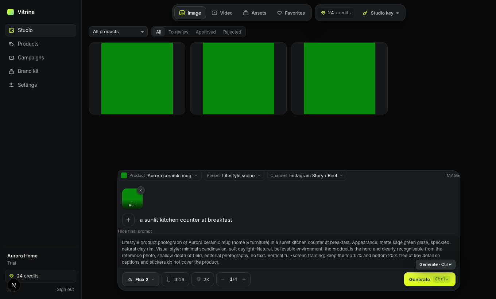

# Vitrina — AI product visuals for e-commerce brands

> Product photos and clips for every channel, from the photo you already have.

Vitrina is a vertical product built on top of an open image/video generation
studio. An e-commerce team uploads a product photo, picks a **preset** (pack
shot, lifestyle scene, flat lay, on-model, product reveal, UGC-style clip…)
and the **channel** it is for (Instagram, TikTok, Amazon, storefront hero,
YouTube, Pinterest, email). Vitrina writes the prompt from the **brand kit**,
picks a model out of the catalog, fixes the ratio and length the channel
wants, tracks every run per workspace, and exports approved results as one
folder per product and channel.

It is sold as a SaaS (the operator's platform key, metered in credits with
Stripe plans) or run self-hosted where every workspace brings its own key.



## What is in the box

- **Studio** — one composer for image and video, a product / preset / channel
  rail, the final prompt on request, a gallery with product and review
  filters, selection, bulk approve / reject / favorite / download.
- **Products** with photos, appearance notes and features; **brand kit**
  (style, palette, audience, things never to show) folded into every prompt.
- **Campaigns** — one product × a set of presets × channels, generated in one
  press, reviewed per channel, exported as a zip filed
  `brand/product/channel/preset-01.jpg`.
- **Workspaces & accounts** — email/password sign-in, trial credits on
  sign-up, invite links with seats per plan, several brands per account with
  a workspace switcher, password reset by email when a sender is configured.
- **Credits & billing** — integer credits reserved before a run and refunded
  on failure, Stripe Checkout, customer portal, idempotent webhook, a manual
  grant script for installs without Stripe.
- **Bring your own key** — a workspace's platform key sealed at rest; runs on
  it cost no credits.
- **38 models** from the inherited catalog, each with its own settings; the
  preset only chooses among what a model declares.
- Local or Vercel Blob storage, a mock platform server for development, unit
  and end-to-end tests, CI, Docker.

## Quick start

```bash
pnpm install
cp .env.example .env            # set APP_SECRET, HF_API_BASE_URL, PLATFORM_API_KEY
pnpm dev                        # http://localhost:3000 — migrations run on boot
```

No platform key yet? Point the studio at the mock platform and see the whole
flow with placeholder results:

```bash
pnpm mock:platform              # :4010
# in .env: HF_API_BASE_URL=http://localhost:4010  PLATFORM_API_KEY=mock-id:mock-secret
```

Sign up at `/register`, fill in the brand kit, add a product with a photo,
open the studio, pick the product and a preset, press Generate.

## Commands

| Command | What it does |
| --- | --- |
| `pnpm dev` / `pnpm build` / `pnpm start` | Dev server, production build (standalone), serve |
| `pnpm lint` · `pnpm typecheck` · `pnpm test` | ESLint, TypeScript, vitest |
| `pnpm test:e2e` | Playwright against a fresh production build and the mock platform |
| `pnpm db:generate` · `pnpm db:migrate` · `pnpm db:studio` | Drizzle migrations and browser |
| `pnpm credits <email> <n> [note]` | Grant credits to a workspace by owner email |
| `pnpm mock:platform` | Stand-in generation API |
| `pnpm brand` | Rebuild icons and the Open Graph card |

## How the pieces fit

```
src/domain      the vertical as data — presets, channels, prompt compiler, pricing, plans
src/generation  the engine — catalog, platform client, request mapper, poll loop, actions
src/server      DB services + server actions — session, workspaces, credits, runs, billing
src/studio      the studio surface — composer, job rail, gallery, viewer, run lifecycle hook
src/ui          app pages' components and stylesheet
src/app         routes: / marketing · /login /register · /app/* · /api/*
```

Read [docs/ARCHITECTURE.md](docs/ARCHITECTURE.md) for the run lifecycle, the
data model and how money moves; [docs/DEPLOY.md](docs/DEPLOY.md) for Docker,
Vercel and Stripe; [docs/VERTICAL.md](docs/VERTICAL.md) to re-aim the product
at another industry — it is a change to data files, not to the engine.

## Business model, in one table

| Plan | Credits / month | Price | Seats | Own key |
| --- | --- | --- | --- | --- |
| Trial | 30 once | free | 1 | — |
| Starter | 500 | €29 | 2 | — |
| Pro | 2,000 | €99 | 5 | yes |
| Studio | 6,000 | €249 | 15 | yes |

One credit ≈ one standard image (2 at 2K, 4 at 4K); video is priced per second
by resolution with tier multipliers. All of it is in `src/domain/plans.ts` and
`src/domain/pricing.ts`.

## Provenance and license

The generation studio this product is built on is
[open-higgsfield](https://github.com/wide-trace/open-higgsfield). See
[NOTICE.md](NOTICE.md): at the time of import the upstream repository carried
no LICENSE file, which matters before this is sold. Vitrina is not
affiliated with Higgsfield AI.
